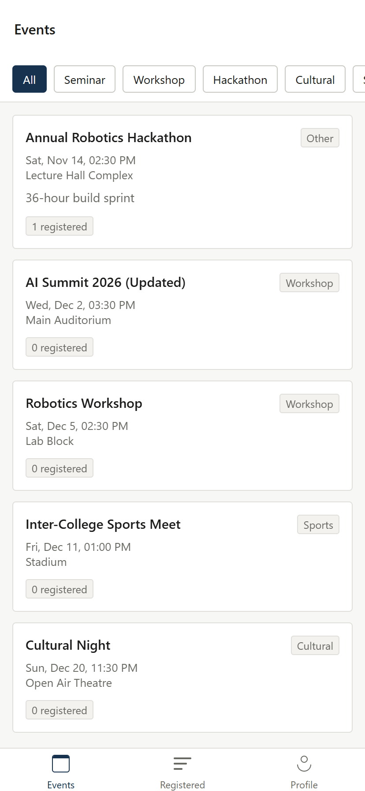
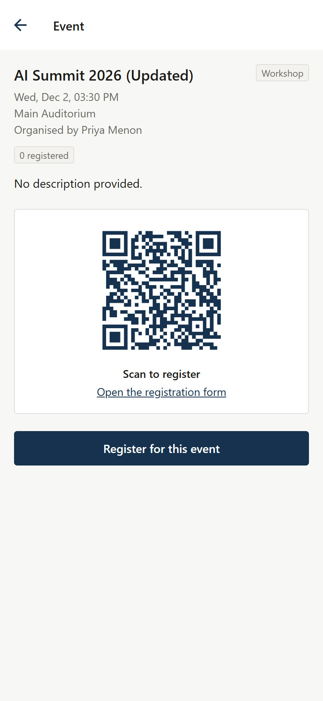

# Campus Events

A campus event management platform. Organisers publish events and track who signed up;
students browse everything on offer and register. Every event carries a QR code that
takes attendees straight to its registration form.

The project ships three parts that share one REST API: a Node/Express backend, a web
client, and a React Native mobile app.


---

## Contents

- [Features](#features)
- [Tech stack](#tech-stack)
- [Project layout](#project-layout)
- [Getting started](#getting-started)
- [Configuration](#configuration)
- [Deployment](#deployment)
- [API reference](#api-reference)
- [Roles and permissions](#roles-and-permissions)
- [How QR codes work](#how-qr-codes-work)
- [Screenshots](#screenshots)
- [Project status](#project-status)

---

## Features

**Accounts and access**
- Email and password sign-up with bcrypt-hashed passwords and JWT sessions
- Two roles — participant and organiser — enforced on the server, not just hidden in the UI
- Institution directory; users whose college is missing can add it during sign-up
- Editable profile, password change, avatar upload, light and dark theme

**Events**
- Create, edit and delete events, with cover images
- Seven categories: Seminar, Workshop, Hackathon, Cultural, Sports, Conference, Other
- Filter by category and free-text search across title, description, venue and category
- Register for an event; the organiser sees the full participant list
- "All events" and "Registered" views

**Production readiness**
- CORS allowlist, rate-limited auth and upload routes, security headers
- Graceful shutdown, health check endpoint, startup config validation
- QR codes rebuild themselves if the host wipes the filesystem

**QR codes**
- Every event gets a QR code automatically
- Paste a Google Form (or any http/https link) and the code is generated pointing at it
- Already have a code? Upload it instead and it takes priority
- No link at all? The code encodes the event's own details, so a scan still shows something useful

---

## Tech stack

| Layer | Technology |
|---|---|
| Backend | Node.js, Express 4, Mongoose 8 |
| Database | MongoDB |
| Auth | JSON Web Tokens, bcryptjs |
| Uploads | Multer (images, 5 MB cap, type-checked) |
| Hardening | helmet, express-rate-limit, CORS allowlist, compression |
| QR | `qrcode` — rendered server-side to PNG |
| Web | HTML, CSS and vanilla JavaScript — no build step |
| Mobile | React Native (Expo), React Navigation |

The web client deliberately avoids a bundler: clone the repo, open the folder with any
static server, and it runs. Nothing to compile, nothing to eject.

---

## Project layout

```
campus_event_mobile/
├── backend/                 Express REST API
│   ├── config/db.js         MongoDB connection
│   ├── controllers/         Request handlers
│   ├── middleware/          JWT auth + role guards
│   ├── models/              Mongoose schemas
│   ├── routes/              Route definitions
│   ├── scripts/             Seed and maintenance scripts
│   ├── utils/               Token signing, uploads, QR generation
│   └── server.js            Entry point
│
├── web/                     Browser client (no build step)
│   ├── assets/              API client, shared helpers, stylesheets, logo
│   ├── index.html           Landing page
│   ├── signin.html          Sign in / create account
│   ├── events.html          Event list, search, registration
│   ├── create-event.html    Create and edit events
│   ├── participants.html    Registration list for an organiser's event
│   └── profile.html         Profile, password, preferences
│
└── mobile/                  React Native app (Expo)
    └── src/
        ├── api/             Fetch client with token handling
        ├── components/      Reusable UI, event card, logo
        ├── context/         Auth state
        ├── navigation/      Stack + tab navigators
        └── screens/         Login, events, details, create, participants, profile
```

---

## Getting started

### Prerequisites

- Node.js 18 or newer
- MongoDB running locally (or a MongoDB Atlas connection string)

### 1. Backend

```bash
cd backend
npm install
cp .env.example .env        # then edit .env - see Configuration below
npm run seed                # optional: adds a few sample institutions
npm start                   # http://localhost:5000
```

Check it is up:

```bash
curl http://localhost:5000/api/health
# {"status":"ok","uptime":1.23}
```

### 2. Web client

The web client is plain static files. Serve the `web/` folder with anything:

```bash
npx http-server web -p 5500
# open http://localhost:5500
```

If your API does not run on `http://localhost:5000/api`, change the one line in
[`web/assets/config.js`](web/assets/config.js):

```js
window.CAMPUS_API_BASE = 'https://api.example.com/api';
```

### Changing the logo

The mark lives in one file, [`web/assets/logo.svg`](web/assets/logo.svg). Replace it and
it updates across the landing page, every in-app header, and the browser tab. Any web
image format works — if you swap in a PNG, update the two `` references and the
`<link rel="icon">` tags to match the new extension.

A dark mark is lifted in dark mode by a filter in `assets/styles.css`; if your logo
already reads well on both grounds, delete that rule.

### 3. Mobile app

```bash
cd mobile
npm install
npm start                   # opens the Expo developer tools
npm run web                 # or run it straight in a browser
```

The app picks a sensible API address for each target on its own:

| Target | Resolved automatically |
|---|---|
| Android emulator | `http://10.0.2.2:5000/api` |
| iOS simulator / web | `http://localhost:5000/api` |

A **physical device** is the exception. It cannot reach `localhost` — that resolves to the
phone itself — so point it at your computer's LAN address by adding an `extra` block to
[`mobile/app.json`](mobile/app.json):

```json
{
  "expo": {
    "extra": { "apiBaseUrl": "http://192.168.1.42:5000/api" }
  }
}
```

Both machines must be on the same network, and the backend must be reachable from it.

---

## Configuration

`backend/.env`:

| Variable | Description |
|---|---|
| `MONGO_URI` | MongoDB connection string, e.g. `mongodb://127.0.0.1:27017/campus_events` |
| `JWT_SECRET` | Secret used to sign tokens. Use a long random value in production |
| `PORT` | Port the API listens on (default `5000`) |

`.env` is git-ignored. `backend/.env.example` is the template to copy.

### Maintenance scripts

```bash
npm run seed          # populate the institution directory
npm run backfill:qr   # generate QR codes for any events created before QR support
```

---

## Deployment

The project can be hosted end to end on free tiers — MongoDB Atlas for the database,
Render for the API, Netlify for the web client — with no card required. A
[`render.yaml`](render.yaml) blueprint is included so Render can configure the API
itself.

**[docs/DEPLOYMENT.md](docs/DEPLOYMENT.md)** is the full walkthrough, including the
environment variables, how to close the CORS loop, and the one real limitation of free
hosting (an ephemeral filesystem, and what that does and does not affect).

Production settings are driven entirely by environment variables, so the same code runs
locally and deployed:

| Variable | Effect |
|---|---|
| `NODE_ENV=production` | Enables the CORS allowlist; stops internal errors reaching clients |
| `CORS_ORIGINS` | Comma-separated list of origins permitted to call the API |
| `TRUST_PROXY=1` | Reads the real client IP behind a platform proxy, so rate limiting is per-user |

---

## API reference

All routes are prefixed with `/api`. Authenticated routes expect an
`Authorization: Bearer <token>` header.

### Auth

| Method | Endpoint | Access | Description |
|---|---|---|---|
| `POST` | `/auth/register` | Public | Create an account; returns a token |
| `POST` | `/auth/login` | Public | Sign in; returns a token |
| `GET` | `/auth/me` | Authenticated | Current user |

`register` accepts either `institution` (an id) or `institutionName` (a name, created if
it does not exist yet).

### Events

| Method | Endpoint | Access | Description |
|---|---|---|---|
| `GET` | `/events` | Authenticated | List events. Filters: `?category=`, `?institution=`, `?q=` |
| `GET` | `/events/:id` | Authenticated | A single event |
| `POST` | `/events/create` | Organiser | Create an event (multipart: `image`, `qrImage`) |
| `PUT` | `/events/:id` | Event owner | Update an event |
| `DELETE` | `/events/:id/delete` | Event owner | Delete an event |
| `POST` | `/events/:id/register` | Authenticated | Register for an event |
| `GET` | `/events/:id/participants` | Event owner | List who registered |
| `GET` | `/events/meta/categories` | Public | Allowed category values |

### Institutions

| Method | Endpoint | Access | Description |
|---|---|---|---|
| `GET` | `/institutions` | Public | List institutions |
| `POST` | `/institutions` | Authenticated | Add one (duplicates rejected, case-insensitive) |

### Users

| Method | Endpoint | Access | Description |
|---|---|---|---|
| `GET` | `/users/profile` | Authenticated | Current profile |
| `PUT` | `/users/profile/update` | Authenticated | Update name, email, institution |
| `PUT` | `/users/change-password` | Authenticated | Change password |
| `PUT` | `/users/settings` | Authenticated | Theme and notification preferences |
| `POST` | `/users/avatar` | Authenticated | Upload a profile picture |

---

## Roles and permissions

Permissions are enforced in middleware on every request, so they hold regardless of what
the client sends.

| Action | Participant | Organiser | Event owner |
|---|:--:|:--:|:--:|
| Browse all events | yes | yes | yes |
| Register for an event | yes | yes | yes |
| Create an event | no | yes | yes |
| Edit / delete an event | no | own events only | yes |
| View a participant list | no | own events only | yes |

An organiser who did not create an event sees it exactly as a participant does — no edit
or delete controls, and the API returns `403` if those endpoints are called directly.

---

## How QR codes work

Every event has a QR code. The source is resolved in this order:

1. **An uploaded code.** If the organiser uploads a `qrImage`, that file is used as-is.
   Useful when a code was printed on posters before the event was added here.
2. **A generated code.** If a `registrationUrl` is supplied — typically a Google Form —
   a PNG is rendered server-side pointing at that link.
3. **A details fallback.** With neither of the above, the code encodes the event's title,
   category, time and venue, so scanning still returns something meaningful.

Generated codes are written to `backend/uploads/qr/event-<id>.png` and regenerated when
the registration link changes. Only `http` and `https` links are accepted.

---

## Screenshots

**Landing page**


**Sign in**


**Participant view** — all events visible, no organiser controls


**Creating an event** — categories, cover image, and both QR options


**Dark theme**


**Narrow screens**


**Mobile app** — event list and event detail with its QR code

<p>
  
  
</p>

---

## Project status

All three parts have been run against a live MongoDB instance and verified end to end:
registration, login, role enforcement, event CRUD, QR generation and decoding, participant
lists, and search. Role behaviour was checked with three accounts — a participant, an
organiser who owns no events, and an event owner — confirming that edit, delete and
participant controls appear only for the owner, and that the API returns `403` when those
endpoints are called directly by anyone else.

The mobile app was built with Metro and driven through sign-in, category filtering, event
detail and registration. It has been exercised on the web target and in a phone-sized
viewport, but not yet on physical Android or iOS hardware — the remaining risk there is
native module behaviour (the image picker in particular), not application logic.

Known gaps, in rough priority order:

- The mobile app is light-theme only; the web client has a light/dark toggle
- Mobile filters by category but has no free-text search, which the web client does have
- The notification preference is stored but nothing sends notifications yet
- No automated test suite
- No pagination — every event is loaded at once, which is fine at this scale but will not
  stay that way
- Uploaded images do not survive a restart on hosts with an ephemeral filesystem.
  Generated QR codes do, because they are rebuilt on demand. See
  [docs/DEPLOYMENT.md](docs/DEPLOYMENT.md) for the options

---

## Licence

Released under the MIT Licence. See [LICENSE](LICENSE).
