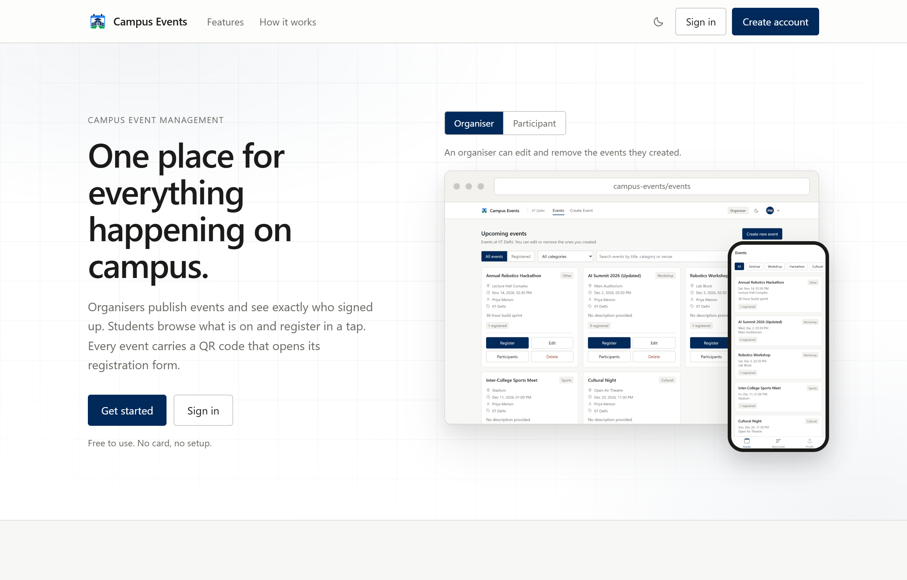

# Campus Events

[](https://github.com/Uzma-Yasmeen/Campus_Event_App/actions/workflows/ci.yml)

A campus event management platform. Organisers publish events and see who signed up;
students browse what is on and register. Each event can carry a QR code that opens its
registration form.

Three parts share one REST API: a Node/Express backend, a web client, and a React Native
mobile app.



## What it does

- **Accounts** — email and password, bcrypt-hashed, JWT sessions
- **Two roles** — participant and organiser, enforced on the server rather than hidden in
  the interface
- **Campus scoping** — you only see events from your own institution
- **Events** — create, edit, delete, with categories, cover images and search
- **Registrations** — organisers see the full participant list for their own events
- **QR codes** — generated from a registration link, or upload one you already have
- **Light and dark themes**, on web

## Running it

You need Node 18+ and MongoDB.

```bash
# 1. API
cd backend
npm install
cp .env.example .env     # set MONGO_URI and JWT_SECRET
npm run seed             # optional sample institutions
npm start                # http://localhost:5000
npm test                 # 29 tests, no database setup needed

# 2. Web client - static files, no build step
npx http-server web -p 5500

# 3. Mobile app
cd mobile && npm install && npm start
```

Pointing the web client somewhere other than `localhost:5000` is one line in
[`web/assets/config.js`](web/assets/config.js).

## Tech

Node.js · Express · MongoDB · Mongoose · JWT · Multer · `qrcode` · React Native (Expo) ·
vanilla JS and CSS on the web, with no bundler.

## Tests

```bash
cd backend && npm test
```

29 tests across auth, events and institutions. They run against a real MongoDB held in
memory, so queries, indexes and validation behave as they do in production without
needing a database installed — which is also why CI needs no service container.

What they pin down, beyond the happy paths:

- Signing in with an unknown account and with a wrong password return **identical**
  replies, so the endpoint cannot be used to discover which addresses are registered
- An organiser cannot publish into a campus they do not belong to, even by putting
  another institution's id in the request body
- Another campus gets `404` rather than `403`, so an event's existence is not disclosed
- Edit, delete and the participant list are refused for an organiser who did not create
  the event
- An event with no registration link gets no QR code at all

Every push and pull request to `main` or `develop` runs these, plus a check that no page
references a missing asset and a scan for credential-shaped strings in tracked files.

---

## Documentation

| Document | Contents |
|---|---|
| [docs/API.md](docs/API.md) | Every endpoint, the permission rules, and how QR codes are resolved |
| [docs/DEPLOYMENT.md](docs/DEPLOYMENT.md) | Deploying free on Atlas, Render and Netlify |
| [CONTRIBUTING.md](CONTRIBUTING.md) | Branching model, versioning and commit conventions |

## Status

The backend and web client are verified end to end against a live database — sign-up,
sign-in, role and ownership rules, campus scoping, event CRUD, QR generation and decoding,
and search. The mobile app runs and has been driven through sign-in, browsing, event
detail and registration on the web target, but not yet on physical hardware.

Not built yet: pagination, email notifications, and a mobile dark theme.

## Licence

MIT. See [LICENSE](LICENSE).
