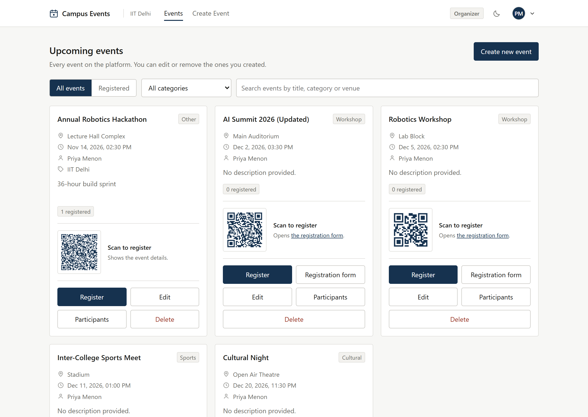
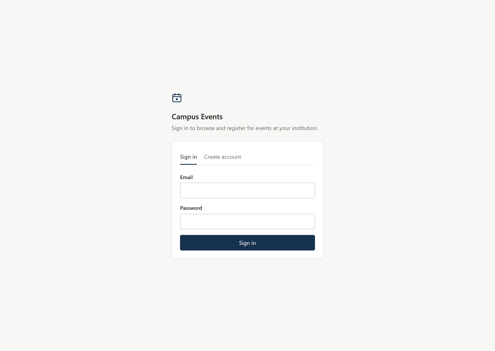
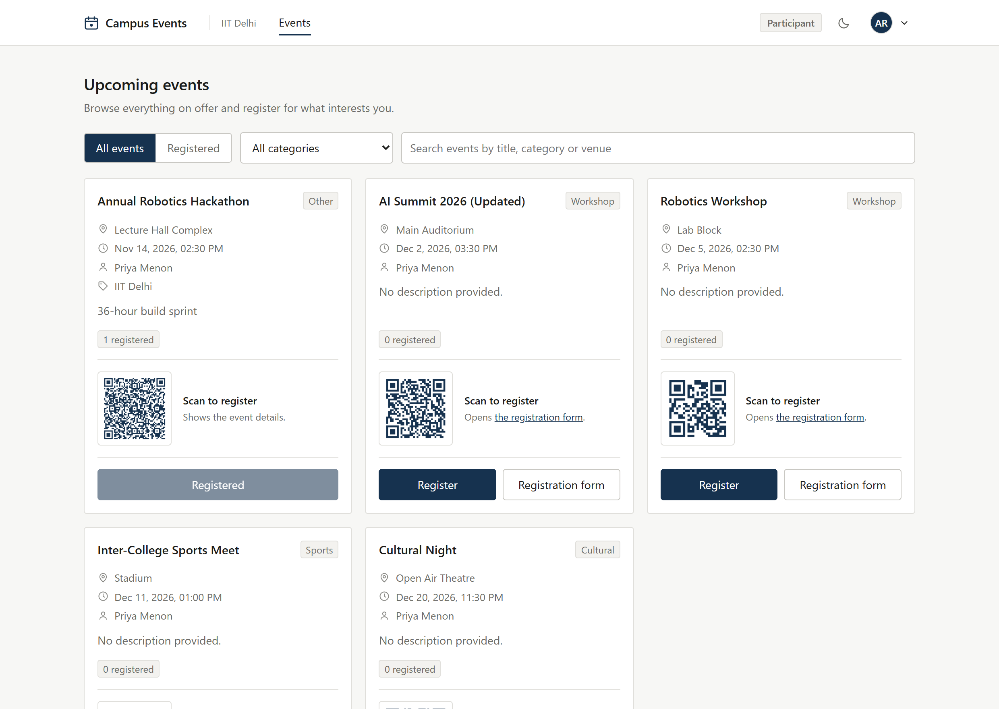
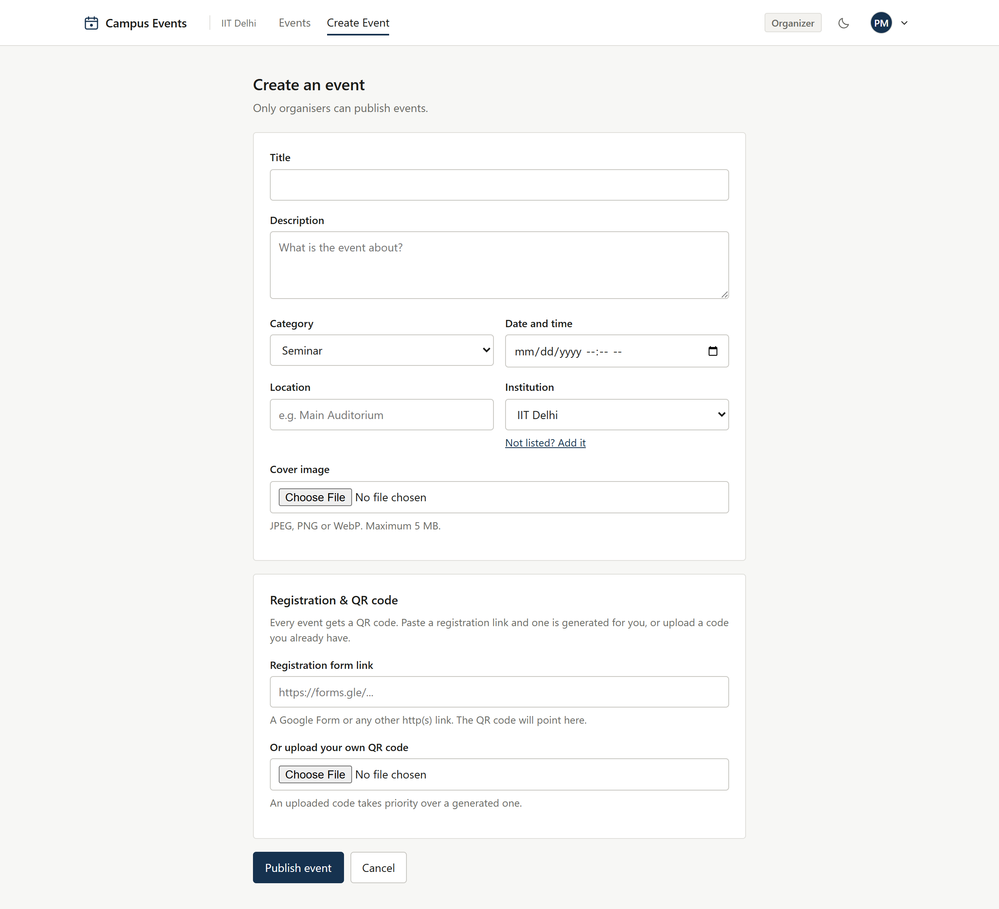
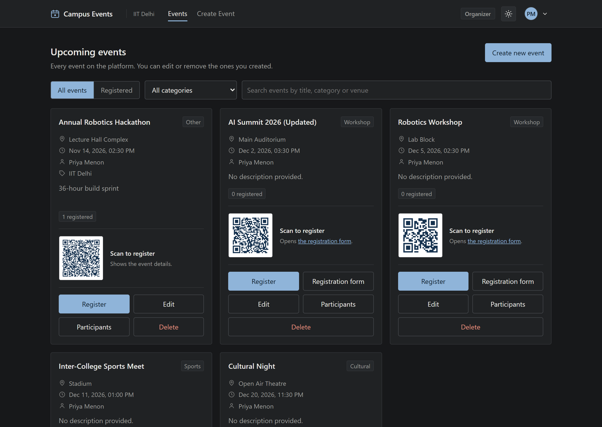
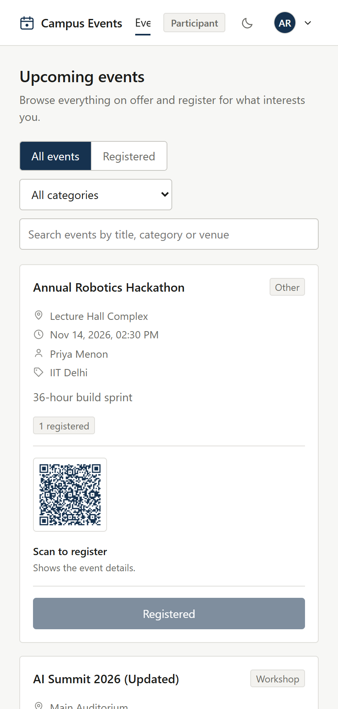

# Campus Events

A campus event management platform. Organisers publish events and track who signed up;
students browse everything on offer and register. Every event carries a QR code that
takes attendees straight to its registration form.

The project ships three parts that share one REST API: a Node/Express backend, a web
client, and a React Native mobile app.



---

## Contents

- [Features](#features)
- [Tech stack](#tech-stack)
- [Project layout](#project-layout)
- [Getting started](#getting-started)
- [Configuration](#configuration)
- [API reference](#api-reference)
- [Roles and permissions](#roles-and-permissions)
- [How QR codes work](#how-qr-codes-work)
- [Screenshots](#screenshots)
- [Project status](#project-status)

---

## Features

**Accounts and access**
- Email and password sign-up with bcrypt-hashed passwords and JWT sessions
- Two roles — participant and organiser — enforced on the server, not just hidden in the UI
- Institution directory; users whose college is missing can add it during sign-up
- Editable profile, password change, avatar upload, light and dark theme

**Events**
- Create, edit and delete events, with cover images
- Seven categories: Seminar, Workshop, Hackathon, Cultural, Sports, Conference, Other
- Filter by category and free-text search across title, description, venue and category
- Register for an event; the organiser sees the full participant list
- "All events" and "Registered" views

**QR codes**
- Every event gets a QR code automatically
- Paste a Google Form (or any http/https link) and the code is generated pointing at it
- Already have a code? Upload it instead and it takes priority
- No link at all? The code encodes the event's own details, so a scan still shows something useful

---

## Tech stack

| Layer | Technology |
|---|---|
| Backend | Node.js, Express 4, Mongoose 8 |
| Database | MongoDB |
| Auth | JSON Web Tokens, bcryptjs |
| Uploads | Multer (images, 5 MB cap, type-checked) |
| QR | `qrcode` — rendered server-side to PNG |
| Web | HTML, CSS and vanilla JavaScript — no build step |
| Mobile | React Native (Expo), React Navigation |

The web client deliberately avoids a bundler: clone the repo, open the folder with any
static server, and it runs. Nothing to compile, nothing to eject.

---

## Project layout

```
campus_event_mobile/
├── backend/                 Express REST API
│   ├── config/db.js         MongoDB connection
│   ├── controllers/         Request handlers
│   ├── middleware/          JWT auth + role guards
│   ├── models/              Mongoose schemas
│   ├── routes/              Route definitions
│   ├── scripts/             Seed and maintenance scripts
│   ├── utils/               Token signing, uploads, QR generation
│   └── server.js            Entry point
│
├── web/                     Browser client (no build step)
│   ├── assets/              API client, shared helpers, stylesheet, logo
│   ├── index.html           Sign in / create account
│   ├── events.html          Event list, search, registration
│   ├── create-event.html    Create and edit events
│   ├── participants.html    Registration list for an organiser's event
│   └── profile.html         Profile, password, preferences
│
└── mobile/                  React Native app (Expo)
    └── src/
        ├── api/             Fetch client with token handling
        ├── components/      Reusable UI, event card, logo
        ├── context/         Auth state
        ├── navigation/      Stack + tab navigators
        └── screens/         Login, events, details, create, participants, profile
```

---

## Getting started

### Prerequisites

- Node.js 18 or newer
- MongoDB running locally (or a MongoDB Atlas connection string)

### 1. Backend

```bash
cd backend
npm install
cp .env.example .env        # then edit .env - see Configuration below
npm run seed                # optional: adds a few sample institutions
npm start                   # http://localhost:5000
```

Check it is up:

```bash
curl http://localhost:5000/api/health
# {"status":"ok","uptime":1.23}
```

### 2. Web client

The web client is plain static files. Serve the `web/` folder with anything:

```bash
npx http-server web -p 5500
# open http://localhost:5500
```

If your API does not run on `http://localhost:5000/api`, set the base URL before
loading `assets/api.js`:

```html
<script>window.CAMPUS_API_BASE = 'https://api.example.com/api';</script>
```

### 3. Mobile app

```bash
cd mobile
npm install
npm start                   # opens the Expo developer tools
```

Point the app at your machine's API. A phone cannot reach `localhost` — that resolves to
the phone itself — so use your computer's LAN address. Edit `expo.extra.apiBaseUrl` in
[`mobile/app.json`](mobile/app.json):

| Target | Value |
|---|---|
| Android emulator | `http://10.0.2.2:5000/api` |
| iOS simulator | `http://localhost:5000/api` |
| Physical device | `http://<your-computer-ip>:5000/api` |

---

## Configuration

`backend/.env`:

| Variable | Description |
|---|---|
| `MONGO_URI` | MongoDB connection string, e.g. `mongodb://127.0.0.1:27017/campus_events` |
| `JWT_SECRET` | Secret used to sign tokens. Use a long random value in production |
| `PORT` | Port the API listens on (default `5000`) |

`.env` is git-ignored. `backend/.env.example` is the template to copy.

### Maintenance scripts

```bash
npm run seed          # populate the institution directory
npm run backfill:qr   # generate QR codes for any events created before QR support
```

---

## API reference

All routes are prefixed with `/api`. Authenticated routes expect an
`Authorization: Bearer <token>` header.

### Auth

| Method | Endpoint | Access | Description |
|---|---|---|---|
| `POST` | `/auth/register` | Public | Create an account; returns a token |
| `POST` | `/auth/login` | Public | Sign in; returns a token |
| `GET` | `/auth/me` | Authenticated | Current user |

`register` accepts either `institution` (an id) or `institutionName` (a name, created if
it does not exist yet).

### Events

| Method | Endpoint | Access | Description |
|---|---|---|---|
| `GET` | `/events` | Authenticated | List events. Filters: `?category=`, `?institution=`, `?q=` |
| `GET` | `/events/:id` | Authenticated | A single event |
| `POST` | `/events/create` | Organiser | Create an event (multipart: `image`, `qrImage`) |
| `PUT` | `/events/:id` | Event owner | Update an event |
| `DELETE` | `/events/:id/delete` | Event owner | Delete an event |
| `POST` | `/events/:id/register` | Authenticated | Register for an event |
| `GET` | `/events/:id/participants` | Event owner | List who registered |
| `GET` | `/events/meta/categories` | Public | Allowed category values |

### Institutions

| Method | Endpoint | Access | Description |
|---|---|---|---|
| `GET` | `/institutions` | Public | List institutions |
| `POST` | `/institutions` | Authenticated | Add one (duplicates rejected, case-insensitive) |

### Users

| Method | Endpoint | Access | Description |
|---|---|---|---|
| `GET` | `/users/profile` | Authenticated | Current profile |
| `PUT` | `/users/profile/update` | Authenticated | Update name, email, institution |
| `PUT` | `/users/change-password` | Authenticated | Change password |
| `PUT` | `/users/settings` | Authenticated | Theme and notification preferences |
| `POST` | `/users/avatar` | Authenticated | Upload a profile picture |

---

## Roles and permissions

Permissions are enforced in middleware on every request, so they hold regardless of what
the client sends.

| Action | Participant | Organiser | Event owner |
|---|:--:|:--:|:--:|
| Browse all events | yes | yes | yes |
| Register for an event | yes | yes | yes |
| Create an event | no | yes | yes |
| Edit / delete an event | no | own events only | yes |
| View a participant list | no | own events only | yes |

An organiser who did not create an event sees it exactly as a participant does — no edit
or delete controls, and the API returns `403` if those endpoints are called directly.

---

## How QR codes work

Every event has a QR code. The source is resolved in this order:

1. **An uploaded code.** If the organiser uploads a `qrImage`, that file is used as-is.
   Useful when a code was printed on posters before the event was added here.
2. **A generated code.** If a `registrationUrl` is supplied — typically a Google Form —
   a PNG is rendered server-side pointing at that link.
3. **A details fallback.** With neither of the above, the code encodes the event's title,
   category, time and venue, so scanning still returns something meaningful.

Generated codes are written to `backend/uploads/qr/event-<id>.png` and regenerated when
the registration link changes. Only `http` and `https` links are accepted.

---

## Screenshots

**Sign in**



**Participant view** — all events visible, no organiser controls



**Creating an event** — categories, cover image, and both QR options



**Dark theme**



**Narrow screens**



---

## Project status

The backend and web client are complete and were verified end to end against a live
MongoDB instance — registration, login, role enforcement, event CRUD, QR generation and
decoding, participant lists, and search.

The mobile app is feature-complete against the same API and passes static checks, but it
has not yet been run on a physical device or emulator; expect to smooth over the usual
platform details on first launch.

Not yet built: server-side pagination, email notifications, and automated tests. These
are the natural next steps rather than known defects.

---

## Licence

Released under the MIT Licence. See [LICENSE](LICENSE).
